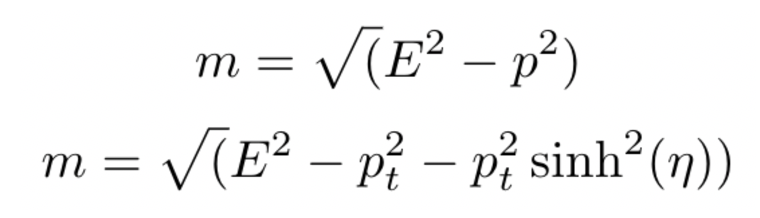

# Lepton Identification Using Neural Nets

## Introduction

This a project that aims to identify lepton flavor (electron or muon) from a sample of leptons produced in ttbar events. The neural nets used for identication are trained using only lepton kinematic information, exploring a combination of machine learning and event reconstruction techniques.

Unless otherwise noted, the instructions for installing packages and applications assume you are running a Unix environment. When this section of the README was last updated (02/01/2019), I was running MacOS 10.13.6, Python 3.6.5, and pip 18.1

This repository used to be housed [here](https://github.com/btannenw/CMS_machineLearning/tree/master/leptonIdentificationNN).

## Development Environment

### Running using Docker
- Install docker and docker-compose [here](https://www.docker.com/get-started).
- Ensure that you are in the `leptonIdentificationNN` folder
- Run `docker-compose up` in the terminal
- Naviagte to `localhost:8888`
    - If this is your first time using the service, then you will have to paste the token that is provided in the terminal
- Enjoy!!
- The jupyter notebooks are stored in `~/jupyter` directory and can be updated there

### Setting up a Virtual Environment
I run this in a virtual environment on my machine to keep my research python environment separate from all other python development. This ensures that I can mess up one environment without ruining the other (yes, I speak from experience).

Instructions to be added shortly.

### Installing and Running Jupyter Notebook
I have Jupyter Notebook installed locally on my machine, but as long as you open jupyter from inside your virtual environment, the notebook will run on your virtual kernel. 

You can find instructions for [installing jupyter](https://jupyter.org/install) here.

For Mac Users:  
To run jupyter in your virtual environment, run `/anaconda3/bin/jupyter_mac.command; exit;` from the same directory where you initialized your virtual environment.

For Everyone Else: 
Google it? ¯\\\_(ツ)_/¯

### Installing the Necessary Packages

I used pip to install the necessary packages. To install the packages needed for this folder, run `pip install numpy sklearn matplotlib scipy uproot pandas` in your terminal window.

### Using the Notebooks

My notebooks often include global lists which I use to keep track of how the weights, biases, and accuracies change throughout the algorithm training. I know this is clunky, but as long as you researt the kernel every time you train the algorithm, this isn't a problem.

## Process Background

### Establishing a Baseline Accuracy
#### Premise
In order to Establish a baseline network accuracy, I used the equations below to calculate the mass of each lepton. Because muons are substantially more massive than electrons, their masses can be used to distinguish between them.

For the sake of simplicity, in events where more than lepton was produced, the lepton with the highest transverse momentum was analyzed.

#### Establishing A Mass Cutoff
<!-- Explain why you need a cutoff -->
I calculated the mass as follows: 
1. Use pt and 𝝋 to find px and py
2. Use pt and 𝜂 to find pz (Eq.1)
3. Use px py and pz to find p
4. Use p and E to find m (Eq. 2)
<!-- 5. Plot mass values to graphically determine the cutoff between electrons and muons (Fig. 1)
6. Divide data into electrons and muons based on mass cutoff determined in step 5 -->

<!-- I plotted the resulting mass -->
Once I found the mass of the lepton with the highest transverse momentum in each event, I plotted the masses to see how they were distributed.  

Looking at the graph, it is apparent that 0.10 GeV is a reasonable mass cutoff to distinguish between electrons and muons. In my code, I labeled anything more massive than 0.10GeV as a muon, and anything smaller than 0.10GeV as an electron.

### Preprocessing the Network Input Data
The dataset in small_v2.root has five factors: transverse momentum (pt), &eta;, &phi;s, Energy (E), and labels (isMuon). In [DataExtraction.py](DataExtraction.py), I used the same methods from establishing a baseline accuracy to manipulate the data from the root file to make a few separate datasets all containting the same data but in different representations. 

#### pt &eta; &phi; E
This dateset is just the four input factors from the root file. These were used without further processing. 

These plots show that the distributions of the four features between electrons and muons are virtually indistinguishable.

#### p2 E2
Given the difficulty of separating pt &eta; &phi; and E in the standard dataset, the purpose of constructing a dataset with only p2 and E2 was to make the relationship between the inputs and the outputs nearly linearly separable (see equation 1 under 'Establishing a Baseline Accuracy'). \
Because the magnitudes of the energy and momentum are so close together (i.e. they differ only after the decimal point), I made the dataset only include the values of p2 and E2 after the decimal point. The result is that the difference in the factors is now a greater fraction of their total value, and will thus be amplified.  

## Training Phase

### Exploring Overtraining
In order to see if my network was overtraining I first started testing my accuracy on a testing dataset at every fiftieth epoch during training. I then plotted the train accuracy and test accuracy on the same plot to see if they diverged. The though process behind this is that if the network was overtraining, the train accuracy would end up substantially higher than the test accuracy. Once I did this and found that the test accuracy tightly correlated with the train accuracy, I trained the network on smaller subsets of the training data to see what the results of the same anlalysis would be. The expectation is that when training on a smaller dataset, the test accuracy would be much more inconsistent with the train accuracy.

### Comparison of Different Datasets
After training a network on the p2 E2 dataset, I trained a network on the pt &eta; &phi; E dataset so that I could compare the results of the contrived dataset to the one similar to one that would be "straight out of the detector." 

These figures show that the results were far better for the network which had only p2 E2 as input variables. This makes sense given the nature of the relationship between the input variables and lepton flavor for each dataset. 

The relationship between lepton flavor and input variable can be described by the following equations, using mass as a proxy for flavor: 

Through these equations, it is clear to see that the relationship between p2 E2 and lepton flavor is far less complicated than the relationship between pt &eta; &phi; E and lepton flavor, and so should be easier for the network to figure out. 
## Model Validation
In order to conclusively determine the optimal network model, I trained the network and tested its results with each network strcuture from <strong>2 &rarr; 1 &rarr; 1 &rarr; 2</strong> to <strong>2 &rarr; 6 &rarr; 6 &rarr; 2</strong>. 

The data collected through this method are summarized in Table I.

<strong>Table I.</strong> Network Accuracy as a function of node structure with row number and 
column number corresponding to the number of nodes in layers 1 and 2, respectively.

|   	| 1          	| 2          	| 3          	| 4          	| 5          	| 6          	|
|---	|------------	|------------	|------------	|------------	|------------	|------------	|
| 1 	| 0.49801522 	| 0.4978888  	| 0.50160552 	| 0.50168137 	| 0.5014791  	| 0.50218705 	|
| 2 	| 0.36573032 	| 0.50292028 	| 0.50752193 	| 0.46332583 	| 0.49973452 	| 0.53667417 	|
| 3 	| 0.48767414 	| 0.50489242 	| 0.50807818 	| 0.50911481 	| 0.49925413 	| 0.50984804 	|
| 4 	| 0.47867311 	| 0.50018963 	| 0.70152461 	| 0.48595484 	| 0.68731511 	| 0.4941468  	|
| 5 	| 0.51343835 	| 0.50676342 	| 0.50084701 	| 0.43139238 	| 0.98098657 	| 0.50256631 	|
| 6 	| 0.49667518 	| 0.51877323 	| 0.50618189 	| 0.52484134 	| 0.46721954 	| 0.96869864 	|

These results are visuaized in the surface plot below.

These results of this analysis suggest that, as it is a local maximum (98%) near the global maximum value (100%), the network with 5 hidden layers in each node is close to the most highly optimized network structure. To test this conclusion further, one could continue to test with more nodes in each layer. However, as the accuracy of this network is already so close to maximum possible accuracy, one’s efforts may be better employed elsewhere.

## Symposium Presentation
The findings of this research project were presented at the University of Virginia Undergraduate Research Symposium. The slides from that presentation can be found [here](https://drive.google.com/file/d/1iAK2S7aP3q0JFwvsYQEwVt5F7FE2Q_en/view?usp=sharing).

## Acknolwedgements
This project would not have been possible without the mentorship of and support from [Chris Neu](http://www.phys.virginia.edu/People/personal.asp?UID=ccn4g) and [Ben Tannenwald](https://github.com/btannenw).

The docker portion of this project was written by [Chad Baily](https://github.com/chadbaily). 
